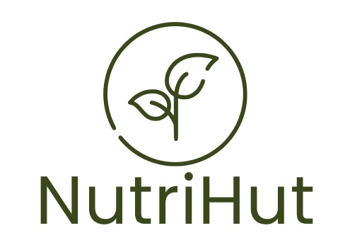

<h1 align="center">
  
</h1>

# NutriHut

Esse projeto foi desenvolvido como Projeto Integrador para o curso de Analise e Desenvolvimento do SENAC. Devido a relevância da problemática nos últimos tempos, escolhemos o nincho de "Saúde e Nutrição".

## ✨ Tecnologias

Esse projeto foi desenvolvido com as seguintes tecnologias:

- [React Native](https://reactnative.dev/)
- [Typescript](https://www.typescriptlang.org/)
- [Expo](https://expo.io/)
- [Async Storage](https://react-native-async-storage.github.io/async-storage/docs/api/)
- [Firebase](https://firebase.google.com/?hl=pt)

## 💻 Projeto

Aplicativo para lhe ajudar a lembrar de dicas nutricionais.

## 🚀 Como executar

- Clone o repositório
- Instale as dependências com `yarn`
- Inicie seu app com `npx expo start`
- Inicie a fake api com `json-server ./src/services server.json --host 192.168.1.4 --port 3333 --delay 700`. Substitua o host pelo seu endereço IP local. Faça o mesmo no arquivo API dentro de services.
- 
---

Feito com ♥ by ats1990

